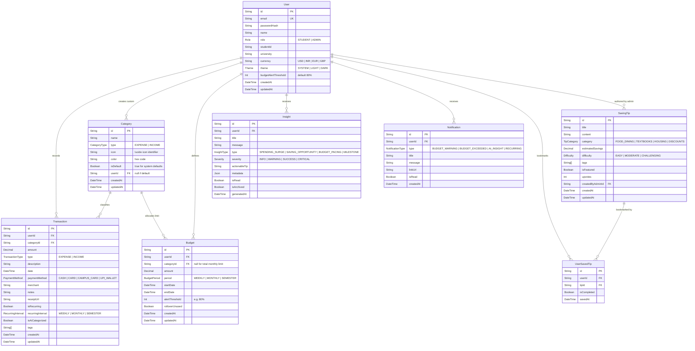

# Campus Coin 🐝🪙
### NextGen Student Budget & Expense Tracker
> **Built for Aptech TechWiz7 Competition (Theme: NextGen BudgetBee)**  
> *Architected with Next.js 14+ App Router, TypeScript, Tailwind CSS, Prisma ORM, NextAuth.js, Recharts, and Google Gemini AI.*

---

## 1. Executive Architecture Overview

Campus Coin is an intelligent, student-first personal finance platform tailored for university and college students navigating erratic allowances, campus dining, semester book splurges, split bills, and peer spending pressure.

### Core Technology Stack
- **Framework**: Next.js 16 (App Router with React Server & Client Components)
- **Language**: TypeScript 5 (Strict Mode)
- **Styling**: Tailwind CSS v4 with dark mode system & glassmorphism components
- **Database & ORM**: Prisma ORM with relational schema (PostgreSQL / SQLite ready)
- **Authentication**: NextAuth.js v4 (Credentials provider + JWT session strategy with role-based claims)
- **Data Visualization**: Recharts (Donut, Multi-Bar, Area, and Trajectory charts)
- **AI Engine**: Google Generative AI (`@google/generative-ai` / Gemini 1.5 Flash) for automated expense classification and proactive student saving insights
- **Form Validation**: Zod & React Hook Form
- **Iconography**: Lucide React

---

## 2. Directory & Module Structure

```
campus-coin/
├── prisma/
│   ├── schema.prisma                 # Declarative data model & relationships
│   ├── seed.ts                       # Seed script: Admin, student demo, default categories & tips
│   └── migrations/                   # SQL migration history
├── public/
│   ├── icons/                        # PWA / web icons
│   └── images/                       # TechWiz7 assets, hero banners
├── src/
│   ├── app/
│   │   ├── (auth)/                   # Public Authentication Route Group
│   │   │   ├── login/page.tsx        # Student & Admin sign-in (with demo quick-fill)
│   │   │   ├── register/page.tsx     # Student registration with campus & currency selection
│   │   │   ├── forgot-password/page.tsx # Password recovery flow
│   │   │   └── layout.tsx            # Clean auth layout (split hero banner)
│   │   ├── (dashboard)/              # Authenticated Student Route Group
│   │   │   ├── layout.tsx            # App shell: Sidebar, Header, MobileNav, Alerts
│   │   │   ├── dashboard/page.tsx    # Student cockpit: KPI cards, velocity gauge, quick-add
│   │   │   ├── transactions/page.tsx # Ledger: Search, multi-filter, pagination, CSV export
│   │   │   ├── categories/page.tsx   # Category manager: Default vs custom, spending limits
│   │   │   ├── budgets/page.tsx      # Budget planner: Category & monthly limits, rollover
│   │   │   ├── reports/page.tsx      # Analytics suite: Recharts breakdowns, trends, cashflow
│   │   │   ├── saving-tips/page.tsx  # Gamified NextGen BudgetBee perks, campus life hacks
│   │   │   ├── notifications/page.tsx# Centralized alerts (budget triggers, AI warnings)
│   │   │   └── settings/page.tsx     # Student profile, theme toggle (Dark/Light), currency
│   │   ├── (admin)/                  # Protected Admin Route Group
│   │   │   ├── layout.tsx            # Admin shell with strict role-check guard
│   │   │   └── admin/
│   │   │       ├── page.tsx          # System analytics, user metrics, AI usage
│   │   │       ├── users/page.tsx    # User directory, role promotion, status toggles
│   │   │       ├── categories/page.tsx # System-wide default categories CRUD
│   │   │       ├── saving-tips/page.tsx # Campus Coin tip & discount CMS
│   │   │       └── system-logs/page.tsx # Security & audit event inspector
│   │   ├── api/                      # REST-style Next.js Route Handlers
│   │   │   ├── auth/
│   │   │   │   ├── [...nextauth]/route.ts # NextAuth authentication handler
│   │   │   │   └── register/route.ts      # New student registration endpoint
│   │   │   ├── transactions/
│   │   │   │   ├── route.ts          # GET (list/filter) | POST (create)
│   │   │   │   ├── [id]/route.ts     # GET | PUT | DELETE
│   │   │   │   └── export/route.ts   # GET (CSV streaming)
│   │   │   ├── categories/
│   │   │   │   ├── route.ts          # GET (merged default + custom) | POST
│   │   │   │   └── [id]/route.ts     # PUT | DELETE
│   │   │   ├── budgets/
│   │   │   │   ├── route.ts          # GET (active budgets + computed spend) | POST
│   │   │   │   └── [id]/route.ts     # PUT | DELETE
│   │   │   ├── reports/
│   │   │   │   ├── summary/route.ts  # Total income, expenses, net savings, rate
│   │   │   │   ├── category-breakdown/route.ts # Category distribution for donut chart
│   │   │   │   ├── monthly-trend/route.ts      # 6-12 month historical cashflow
│   │   │   │   └── daily-spending/route.ts     # Current month daily spending pace
│   │   │   ├── ai/
│   │   │   │   ├── categorize/route.ts # Smart merchant/note auto-categorization
│   │   │   │   ├── insights/route.ts   # Contextual student spending suggestions
│   │   │   │   └── chat/route.ts       # BudgetBee AI Assistant copilot
│   │   │   ├── saving-tips/
│   │   │   │   ├── route.ts          # GET published tips & challenges
│   │   │   │   └── [id]/bookmark/route.ts # POST / DELETE student bookmark
│   │   │   ├── notifications/
│   │   │   │   ├── route.ts          # GET unread alerts | PATCH mark all read
│   │   │   │   └── [id]/route.ts     # PATCH mark read | DELETE
│   │   │   ├── user/
│   │   │   │   ├── profile/route.ts  # GET / PATCH student profile & campus details
│   │   │   │   └── settings/route.ts # PATCH theme, currency, alert thresholds
│   │   │   └── admin/
│   │   │       ├── stats/route.ts    # Global usage & platform stats
│   │   │       ├── users/route.ts    # Student management endpoint
│   │   │       ├── categories/route.ts # Global default categories endpoint
│   │   │       └── saving-tips/route.ts # Tip publisher endpoint
│   │   ├── layout.tsx                # Root layout (SessionProvider, ThemeProvider)
│   │   ├── page.tsx                  # Public landing / marketing page
│   │   └── globals.css               # Global Tailwind CSS directives & tokens
│   ├── components/
│   │   ├── ui/                       # Design system primitives (Button, Card, Input, Modal, etc.)
│   │   ├── layout/                   # Sidebar, AdminSidebar, Header, ThemeToggle, NotificationBell
│   │   ├── dashboard/                # StatCard, VelocityMeter, QuickTransactionModal, OverviewChart
│   │   ├── transactions/             # TransactionTable, TransactionFilters, AddEditModal, ReceiptView
│   │   ├── budgets/                  # BudgetCard, ProgressBar, AddBudgetModal, RolloverBadge
│   │   ├── reports/                  # CategoryPieChart, MonthlyBarChart, SpendingAreaChart, MetricCard
│   │   ├── saving-tips/              # TipCard, FilterPills, BookmarkToggle, ChallengeProgressBar
│   │   ├── notifications/            # NotificationDropdown, NotificationRow, AlertToast
│   │   ├── settings/                 # ThemeSelector, CurrencyPicker, ThresholdSlider
│   │   └── admin/                    # UserTable, GlobalCategoryForm, TipEditorModal, SystemChart
│   ├── hooks/                        # Custom React hooks (useTransactions, useBudgets, useTheme)
│   ├── lib/
│   │   ├── prisma.ts                 # Prisma Client singleton
│   │   ├── auth.ts                   # NextAuth credentials & JWT callback configuration
│   │   ├── gemini.ts                 # Google Gemini API client & structured prompts
│   │   ├── utils.ts                  # cn class merger, currency formatters, date utilities
│   │   ├── constants/                # Default categories, icons, currency options, seed fixtures
│   │   └── validators/               # Zod schemas for forms and API validation
│   ├── types/
│   │   ├── index.ts                  # Shared domain types
│   │   ├── next-auth.d.ts            # NextAuth session/JWT augmentation with roles
│   │   └── api.ts                    # Standard API response wrappers & query filters
│   └── middleware.ts                 # Route guards for `/admin/:path*` and `/(dashboard)/:path*`
```

---

## 3. Data Model Plan (Prisma ORM)

### Entity Relationship Diagram


### Key Relational Rules
1. **Category Isolation**: System default categories have `userId = null` and `isDefault = true`. All students see default categories. A student can also create custom categories (`userId = student.id`). Unique constraint on `[userId, name, type]`.
2. **Flexible Budgeting**: A budget can target a specific `categoryId` (e.g. "Dining Hall limit $200") or have `categoryId = null` representing the student's overall monthly spending ceiling.
3. **Decimal Precision**: Financial fields (`amount`, `estimatedSavings`) use `Decimal(12, 2)` to eliminate floating-point rounding errors.
4. **Cascade Deletes**: Deleting a user cascades to transactions, budgets, insights, and notifications. Deleting a category restricts deletion if transactions are linked (or soft-reassigns to "Miscellaneous").

---

## 4. Route Map & Auth Guard Plan

| Route | Role / Auth Guard | Layout Shell | Description & Capabilities |
|---|---|---|---|
| `/` | Public | Marketing Layout | Landing page, TechWiz7 BudgetBee features, interactive calculator preview, sign-in CTA. |
| `/login` | Public (Guest only) | Auth Split Layout | Credentials login with Quick Demo Account buttons (Demo Student, Demo Admin). |
| `/register` | Public (Guest only) | Auth Split Layout | Student onboarding: Name, University, Student ID, Preferred Currency, Password. |
| `/forgot-password` | Public | Auth Split Layout | Self-serve password reset request. |
| `/dashboard` | Protected (`STUDENT`, `ADMIN`) | Student Shell | Main cockpit: Net Balance, Monthly Spend vs Budget, Velocity Meter, Quick Add, AI Alerts. |
| `/transactions` | Protected (`STUDENT`, `ADMIN`) | Student Shell | Interactive ledger: Filters (date, category, payment method), search, CSV export, Add/Edit/Delete. |
| `/categories` | Protected (`STUDENT`, `ADMIN`) | Student Shell | Visual category cards with spending progress, default vs custom badge, custom category creator. |
| `/budgets` | Protected (`STUDENT`, `ADMIN`) | Student Shell | Budget planning interface: Progress bars, 80% threshold warnings, rollover settings. |
| `/reports` | Protected (`STUDENT`, `ADMIN`) | Student Shell | Visual financial reports: Category donut, 6-month cashflow bars, daily spending trajectory, download summary. |
| `/saving-tips` | Protected (`STUDENT`, `ADMIN`) | Student Shell | NextGen BudgetBee student lifehacks, campus discount board, bookmark & complete money challenges. |
| `/notifications` | Protected (`STUDENT`, `ADMIN`) | Student Shell | Central notifications hub: Filter by unread, mark all read, direct links to triggered transactions/budgets. |
| `/settings` | Protected (`STUDENT`, `ADMIN`) | Student Shell | Dark mode switch (Light/Dark/System), currency selector, alert thresholds, profile management. |
| `/admin` | Protected (`ADMIN` only) | Admin Shell | Platform overview: Total registered students, system spend volume, AI token usage, active budgets. |
| `/admin/users` | Protected (`ADMIN` only) | Admin Shell | Student directory, role switch (Student <-> Admin), account status toggle. |
| `/admin/categories` | Protected (`ADMIN` only) | Admin Shell | System-wide category master list: Add/Edit standard student categories seen by all users. |
| `/admin/saving-tips` | Protected (`ADMIN` only) | Admin Shell | CMS for publishing, editing, and categorizing student saving tips and student discounts. |
| `/admin/system-logs` | Protected (`ADMIN` only) | Admin Shell | Real-time audit logs, error logs, and AI categorization accuracy monitoring. |

### Edge Middleware Auth Guard (`middleware.ts`)
- Any request to `/admin/*` without an authenticated session containing `role === 'ADMIN'` is redirected to `/login?error=Unauthorized` or `/dashboard`.
- Any request to `/(dashboard)/*` without a valid session token is redirected to `/login?callbackUrl=...`.
- Authenticated users visiting `/login` or `/register` are redirected to `/dashboard`.

---

## 5. REST-Style API Route Handlers Plan

### Authentication & User Endpoints
- `POST /api/auth/register`: Validate student payload via Zod, hash password with `bcryptjs`, initialize default student profile & starter categories.
- `GET /api/user/profile`: Retrieve active student profile, university, and preference metadata.
- `PATCH /api/user/profile`: Update name, university, student ID, avatar.
- `PATCH /api/user/settings`: Update dark mode theme, currency code, and notification thresholds.

### Transactions Endpoints
- `GET /api/transactions`: Fetch paginated transactions with query filters (`startDate`, `endDate`, `categoryId`, `type`, `search`, `page`, `limit`).
- `POST /api/transactions`: Create transaction; automatically triggers budget threshold check and creates alert notification if `spent >= 80%`.
- `GET /api/transactions/[id]`: Retrieve single transaction details.
- `PUT /api/transactions/[id]`: Update transaction details, re-evaluate affected budgets.
- `DELETE /api/transactions/[id]`: Delete transaction.
- `GET /api/transactions/export`: Stream filtered transactions as a standard RFC-4180 CSV file.

### Categories Endpoints
- `GET /api/categories`: Fetch union of system default categories (`userId = null`) and the current user's custom categories (`userId = session.user.id`).
- `POST /api/categories`: Create student custom category (validates icon, color, and duplicate name).
- `PUT /api/categories/[id]`: Update custom category (rejects edits to system default categories unless admin).
- `DELETE /api/categories/[id]`: Delete custom category (ensures safe fallback or checks for zero linked transactions).

### Budgets Endpoints
- `GET /api/budgets`: Fetch all budgets for active period with dynamic calculated spend (`actualSpent = sum(transactions)` in range) and over-budget status.
- `POST /api/budgets`: Create or upsert category/monthly budget with custom alert threshold.
- `PUT /api/budgets/[id]`: Modify budget amount, period, or rollover toggle.
- `DELETE /api/budgets/[id]`: Remove budget rule.

### Reports & Analytics Endpoints
- `GET /api/reports/summary?month=YYYY-MM`: Returns `{ totalIncome, totalExpense, netSavings, savingsRate, topCategory }`.
- `GET /api/reports/category-breakdown?month=YYYY-MM`: Formatted dataset for Recharts Donut/Pie (`{ name, value, color, percentage }`).
- `GET /api/reports/monthly-trend?months=6`: Formatted historical series for Recharts Bar Chart (`[{ month, income, expense, savings }]`).
- `GET /api/reports/daily-spending?month=YYYY-MM`: Daily cumulative spending curve compared to linear budget pacing for Recharts Area Chart.

### AI Engine Endpoints (Google Gemini 1.5 Flash)
- `POST /api/ai/categorize`: Accepts `{ description, merchant, amount }`. Returns predicted `{ categoryId, categoryName, confidence, tags }` using prompt engineering and system categories.
- `GET /api/ai/insights`: Synthesizes current month transactions and budget pacing to generate 3-5 structured, actionable student financial insights (e.g. food surge during midterms, uncancelled trial subscriptions).
- `POST /api/ai/chat`: Interactive BudgetBee AI chat advisor answering questions like *"Can I afford dinner at the campus diner tonight?"* based on remaining budget.

### Saving Tips & Gamification Endpoints
- `GET /api/saving-tips`: Retrieve published tips with category filters, difficulty, and student bookmark status (`isBookmarked`, `isCompleted`).
- `POST /api/saving-tips/[id]/bookmark`: Toggle bookmark or completed challenge status for the student.
- `POST /api/saving-tips/[id]/upvote`: Upvote a community-vetted student money hack.

### Notifications Endpoints
- `GET /api/notifications`: Retrieve latest 20 notifications with unread count.
- `PATCH /api/notifications`: Mark all notifications as read.
- `PATCH /api/notifications/[id]`: Mark individual notification as read.
- `DELETE /api/notifications/[id]`: Dismiss/delete notification.

### Admin Endpoints (`/api/admin/*`)
- `GET /api/admin/stats`: Aggregate system KPIs (total students, total transactions, total volume, AI queries executed, active budgets).
- `GET /api/admin/users`: List registered students with pagination, search, and activity metrics.
- `PATCH /api/admin/users/[id]`: Promote/demote role (`STUDENT` <-> `ADMIN`) or deactivate account.
- `POST /api/admin/categories`: Create new global default category.
- `PUT /api/admin/categories/[id]`: Edit global default category.
- `DELETE /api/admin/categories/[id]`: Remove global default category.
- `POST /api/admin/saving-tips`: Create and publish new saving tip / campus deal.
- `PUT /api/admin/saving-tips/[id]`: Edit saving tip.
- `DELETE /api/admin/saving-tips/[id]`: Delete saving tip.

---

## 6. Architecture Assumptions Flagged for Confirmation

Before executing **Prompt 02 (Implementation)**, the following key architectural assumptions are highlighted for confirmation:

1. **Database Dialect**: Defaulting to **SQLite** (`file:./dev.db`) for immediate zero-config local evaluation and offline judging during Aptech TechWiz7, with 1-line compatibility to switch to **PostgreSQL** via `DATABASE_URL` for production deployment.
2. **AI Provider & Model**: Leveraging Google Gemini (`gemini-1.5-flash`) via the installed `@google/generative-ai` package, with an intelligent local heuristic fallback (keyword-to-category rule engine) so the app functions 100% reliably even if no `GEMINI_API_KEY` is provided during competition evaluation.
3. **Session Strategy**: Using NextAuth.js **JWT strategy** with encrypted tokens containing `{ id, email, name, role }`. This enables instant sub-millisecond edge route guarding in Next.js `middleware.ts` without database lookups on every page request.
4. **Currency Handling**: Allowing each student to choose their display currency (USD `$`, INR `₹`, EUR `€`, GBP `£`, PKR `₨`, CAD `$`, AUD `$`) stored in `User.currency`, formatted dynamically via `Intl.NumberFormat`.
5. **Admin Access Bootstrap**: Pre-seeding a default Admin account (`admin@campuscoin.edu` / `Admin@123`) and a Demo Student account (`student@campuscoin.edu` / `Student@123`) with realistic mock transactions, budgets, and insights for immediate judge walkthroughs.

---

## 7. Quick Start & Setup Guide

### 1. Environment Configuration
Create a `.env` file in the project root:
```env
# Database
DATABASE_URL="file:./dev.db"

# NextAuth
NEXTAUTH_URL="http://localhost:3000"
NEXTAUTH_SECRET="campus-coin-techwiz7-super-secret-jwt-key"

# Google Gemini AI (Optional - heuristic fallback included)
GEMINI_API_KEY=""
```

### 2. Database Migration & Seeding
```bash
npx prisma generate
npx prisma db push
npx tsx prisma/seed.ts
```

### 3. Run Development Server
```bash
npm run dev
```
Open [http://localhost:3000](http://localhost:3000) to view Campus Coin.

---

## 7. Transaction & Category Management Architecture

### A. Transaction Deletion & Historical Integrity (SRS Compliance)
- **Design Decision**: Soft-Delete Strategy via `deletedAt` timestamp.
- **SRS Justification**: The Software Requirements Specification explicitly requires that the system "retains the full history" for student financial velocity analysis, audit reporting, and AI trend generation. Hard-deleting transaction records destroys temporal continuity and invalidates historical monthly snapshot reports.
- **Implementation**: When a transaction is deleted, `deletedAt = new Date()` is recorded. All user-facing lists, balance aggregations, and budget calculations filter with `deletedAt: null`. This preserves total auditability and referential integrity while removing the item from the student's active views.

### B. Recurring Transactions & Occurrence Materialization
- **Rule Storage**: Stored directly on the `Transaction` entity via `isRecurring` (boolean), `recurringInterval` (enum: "MONTHLY"), `recurringEndDate` (DateTime | null), and `recurringGroupId` (UUID/CUID grouping all materialized instances).
  - *Why this choice*: For student recurring expenses (monthly hostel rent, monthly allowance, Spotify/Netflix student subscriptions), maintaining recurrence metadata directly on transactions provides series cohesion without requiring complex relational junction tables, while allowing each past occurrence to exist as an immutable financial snapshot.
- **Materialization Engine**: Dual strategy:
  1. *On-Demand Materialization*: Automatically executed when a student accesses their transactions ledger or dashboard cockpit (`src/lib/recurring.ts`). Any pending monthly occurrences between the last occurrence and today are generated on-the-fly.
  2. *Scheduled Production Job Stub*: Exposed at `/api/cron/recurring-transactions` protected by a `CRON_SECRET` header for external cron runners (Vercel Cron, AWS EventBridge, or GitHub Actions).
- **Recurring Series Edits & Deletes**:
  - The UI and API support two modification scopes:
    1. *This occurrence only*: Modifies/soft-deletes only the selected occurrence and detaches it from the recurring series.
    2. *This and all future occurrences*: Updates/soft-deletes the current occurrence and all future occurrences in the series (`recurringGroupId` matching and `date >= current`).

### C. Category Management & Deletion Guard
- **Partitioned Categories**:
  - *System Defaults*: Protected read-only categories (Income: Allowance, Part-time Job, Scholarship, Gift, Other Income; Expense: Food, Transport, Hostel/Rent, Academics, Subscriptions, Entertainment, Miscellaneous).
  - *Custom Categories*: Fully editable personal categories created by students.
- **Type Lock Guard**: Once transactions are recorded against a category, its type (`INCOME` vs `EXPENSE`) is permanently locked to prevent historical corruption in ledger summaries.
- **Name Uniqueness**: Case-insensitive duplicate name prevention per user and per type.
- **Deletion Guard & Reassignment Flow**:
  - Deleting a category with existing transactions is blocked by default unless reassigned.
  - Students can choose to:
    1. Automatically move all attached transactions to the system fallback ("Miscellaneous" for expenses, "Other Income" for income), OR
    2. Reassign them to another custom or default category of the same type via the `CategoryPicker`.

### D. Unified Reusable Component (`CategoryPicker`)
- Built as a single reusable component located at `src/components/categories/category-picker.tsx`.
- Supports type filtering (`INCOME`, `EXPENSE`, `ALL`), search filtering, default-first grouping, custom color badges, and accessible keyboard navigation.
- Shared without duplication across:
  - Transactions Quick-Add & Edit modal
  - Transactions filter bar
  - Category deletion reassignment dialog
  - CSV import mapper and Budget forms

---

## 8. Real-Time Dashboard Aggregations & Budget Engine

### A. Calendar Month Boundaries & Timezone Consistency
- **Design Decision**: Consistent UTC Calendar Month evaluation across client and server.
- **Specification**: Dates for any given month (`YYYY-MM`) are strictly bounded between `YYYY-MM-01T00:00:00.000Z` and `YYYY-MM-[lastDay]T23:59:59.999Z`.
- **Justification**: Prevents edge-of-month timezone skew across disparate client devices and serverless environments, guaranteeing exact alignment between transactions, budget periods, and reports.

### B. High-Performance Server Aggregations (Zero Client Summing)
- **Database Query Offloading**: All aggregations are performed via PostgreSQL `Prisma.groupBy` and `Prisma.aggregate` queries in [`src/lib/budget-service.ts`](file:///d:/CampusCoin%20End-to-End%20Web%20Solutions_SRS/compus%20coin%20antigravity/src/lib/budget-service.ts):
  - Actual expense per category is calculated with `prisma.transaction.groupBy({ by: ['categoryId'], _sum: { amount: true } })`.
  - Monthly and all-time totals are calculated with `prisma.transaction.groupBy({ by: ['type'], _sum: { amount: true } })`.
- **Clarity of Figures**:
  - The dashboard prominently displays **This Month Net Cashflow** (`monthIncome - monthExpense`) and clearly counterbalances it with the student's **All-Time Balance** (`allTimeIncome - allTimeExpense`), eliminating any confusion.

### C. Budget Architecture & Expense Scope
- **Composite Unique Constraint**: A budget record is uniquely constrained on `[userId, categoryId, month]`.
- **Expense Spending Caps**: Budgets are strictly defined for `EXPENSE` categories (e.g. Food, Entertainment, Transport). Income targets are tracked independently via the student's baseline Monthly Allowance and Savings Goal on their user profile.
- **Shared Aggregation Service**: The Budgets Page and the Dashboard's "Budget vs. Actual" widget consume the same backend service ([`src/lib/budget-service.ts`](file:///d:/CampusCoin%20End-to-End%20Web%20Solutions_SRS/compus%20coin%20antigravity/src/lib/budget-service.ts)) to guarantee 100% data parity.
- **Accessible Progress Bar States**:
  - **Normal (`< 80%`)**: Emerald / Indigo progress bar, `CheckCircle` icon, "On Track" badge.
  - **Warning (`80% – 100%`)**: Amber progress bar, `AlertTriangle` icon, "Near Limit (X%)" badge.
  - **Exceeded (`> 100%`)**: Red progress bar, `AlertOctagon` icon, "Over Budget (+$$)" badge.

### D. Automated Threshold Notifications & Rollover
- **Notification Triggers**: When spend crosses the 80% and 100% marks, a `Notification` record (`BUDGET_WARNING` or `BUDGET_EXCEEDED`) is automatically created once per month per threshold crossing (guarded by `[userId, type, month, categoryId]` index checks).
- **Month Rollover**: Spending is strictly isolated to its respective calendar month. For budget limits, students can click **"Rollover from Last Month"** to copy forward previous limits without tedious re-entry.

## 9. Financial Reports & Analytics (Recharts & Client-Side Export)

### A. Visual Charts & Multi-Cadence Pacing
- **Category Donut Chart ([`src/components/reports/category-donut-chart.tsx`](file:///d:/CampusCoin%20End-to-End%20Web%20Solutions_SRS/compus%20coin%20antigravity/src/components/reports/category-donut-chart.tsx))**:
  - Recharts `PieChart` (`innerRadius="64%"`, `outerRadius="88%"`) with centered total outflow label.
  - Interactive slice hover and custom tooltip with category color, amount, percentage, and transaction count.
  - Dedicated legend list displaying category icon, color dot, dollar amount, and progress bar.
- **6-Month Cashflow Trajectory ([`src/components/reports/cashflow-trend-chart.tsx`](file:///d:/CampusCoin%20End-to-End%20Web%20Solutions_SRS/compus%20coin%20antigravity/src/components/reports/cashflow-trend-chart.tsx))**:
  - Grouped bar chart across the trailing 6 months clearly distinguishing Income (emerald) and Expense (rose).
  - 4-month net surplus summary strip highlighting positive/negative cashflow trends.
- **Spending Rhythm & Cadence ([`src/components/reports/spending-rhythm-chart.tsx`](file:///d:/CampusCoin%20End-to-End%20Web%20Solutions_SRS/compus%20coin%20antigravity/src/components/reports/spending-rhythm-chart.tsx))**:
  - Smooth toggle between **Daily Flow** (days 1–31 with peak spend day highlighted in amber) and **Weekly Cadence** (5-week calendar summary).
- **Graceful Zero-State Handling**: All charts render user-friendly empty states for months with no transactions rather than broken or blank containers.

### B. Synchronized Filter Bar & Client-Side Export
- **Filter Bar ([`src/components/reports/report-filter-bar.tsx`](file:///d:/CampusCoin%20End-to-End%20Web%20Solutions_SRS/compus%20coin%20antigravity/src/components/reports/report-filter-bar.tsx))**:
  - Month picker (`<` and `>` navigation, "Today" shortcut).
  - Category multi-select dropdown with count badges.
  - Cashflow type toggle (`All Cashflow`, `Expenses`, `Income`).
  - Real-time synchronization with URL query parameters (`?month=...&categories=...&type=...`) ensuring views are shareable and survive page refreshes.
- **Client-Side PDF & PNG Export ([`src/components/reports/report-export-button.tsx`](file:///d:/CampusCoin%20End-to-End%20Web%20Solutions_SRS/compus%20coin%20antigravity/src/components/reports/report-export-button.tsx))**:
  - Uses `html-to-image` for full CSS `lab()` and `oklch()` fidelity, wrapped client-side in `jsPDF`.
  - Meaningfully named: `campus-coin-report-<username>-<month>.pdf`.
  - Includes SRS Section 2.1 personal student record-keeping disclaimer badge.

## 10. Personalized Saving Tips & Optional Gemini AI Features

### A. Deterministic Rule-Based Saving Tips Engine (Zero AI Overhead)
- **Algorithm Architecture ([`src/lib/tips-service.ts`](file:///d:/CampusCoin%20End-to-End%20Web%20Solutions_SRS/compus%20coin%20antigravity/src/lib/tips-service.ts))**:
  - Evaluates rolling 2-month category averages, current month velocity, active budget limits, and day of month pacing against 5 deterministic rules:
    1. `BUDGET_PACE_EXCEEDED`: Projects monthly spend from daily velocity and calculates safe daily cap.
    2. `SURGE_VS_AVERAGE`: Flags categories where spend is > 20% (and >= $15) higher than the 2-month baseline.
    3. `SUBSCRIPTION_AUDIT`: Identifies recurring digital subscriptions exceeding 8% of total spending or $20/month.
    4. `UNBUDGETED_SPIKE`: Detects uncapped categories with >= $35 in spend and recommends a target limit.
    5. `DISCRETIONARY_SAVINGS`: Analyzes dining and entertainment spend taking > 35% of total budget and advises meal prep alternatives.
  - Ranks candidates by estimated monthly dollar savings (`impactScore`) and selects top 3–5.
  - Low-data state for new users (< 4 transactions): displays friendly message *"Add a few more transactions across your campus routine to unlock personalized savings advice!"*.
  - User actions: Pin (anchors tip to top) and Dismiss (archives to history) scoped strictly to authenticated user via [`PATCH /api/saving-tips/[id]`](file:///d:/CampusCoin%20End-to-End%20Web%20Solutions_SRS/compus%20coin%20antigravity/src/app/api/saving-tips/%5Bid%5D/route.ts).

### B. Optional AI Expense Categorization (Server-Only Gemini Integration)
- **Server Integration ([`src/lib/gemini.ts`](file:///d:/CampusCoin%20End-to-End%20Web%20Solutions_SRS/compus%20coin%20antigravity/src/lib/gemini.ts) & [`src/app/api/ai/categorize/route.ts`](file:///d:/CampusCoin%20End-to-End%20Web%20Solutions_SRS/compus%20coin%20antigravity/src/app/api/ai/categorize/route.ts))**:
  - Accepts description and type alongside user's category list (`names` + `types` only). Never exposes transaction history or PII.
  - `GEMINI_API_KEY` remains strictly server-side.
  - Silent graceful failure: Any network drop, missing key, or quota limit returns `{ suggestion: null }` without throwing 500 errors. Manual selection continues 100% unaffected.
  - Batch-capable function: `suggestCategoriesBatchWithGemini` supports multi-item CSV imports.
- **Client UX ([`src/components/transactions/transaction-modal.tsx`](file:///d:/CampusCoin%20End-to-End%20Web%20Solutions_SRS/compus%20coin%20antigravity/src/components/transactions/transaction-modal.tsx))**:
  - Debounced client requests (500ms after user pauses typing description).
  - Displays inline chip near category field: `"AI suggests: Food — Accept?"`.
  - Single-click to accept (selects category in picker); ignorable and dismissible. Never auto-selects without user action.
  - Stores both `aiSuggestedCategory` and actual chosen category in `Transaction` table for correction data tracking.

### C. Optional AI Monthly Insights (Server-Only Gemini Narrative)
- **Server Integration ([`src/app/api/insights/monthly/route.ts`](file:///d:/CampusCoin%20End-to-End%20Web%20Solutions_SRS/compus%20coin%20antigravity/src/app/api/insights/monthly/route.ts))**:
  - Transmits only an anonymized compact monthly summary (category totals, net savings, budget status, trailing 2-month deltas).
  - Generates a concise 2–4 sentence narrative plus 1 concrete actionable recommendation.
  - Cost control: 10-minute rate-limiting cooldown with confirm-to-regenerate prompt.
  - Version history model: Stores every generated narrative in `Insight` table with `[userId, month, generatedAt]`, allowing students to audit previous monthly insights.
- **UI & Labeling ([`src/components/insights/monthly-insight-card.tsx`](file:///d:/CampusCoin%20End-to-End%20Web%20Solutions_SRS/compus%20coin%20antigravity/src/components/insights/monthly-insight-card.tsx))**:
  - On-demand generation via `"Generate this month's insight"` button (never auto-fires on page load).
  - Prominent SRS advisory disclaimer: *"Automated AI suggestion for personal planning, not certified financial advice."*
  - Interactive "Insight History" drawer to view earlier generated versions.


"# CampusCoin-End-to-End-Web-Solutions_SRS" 
